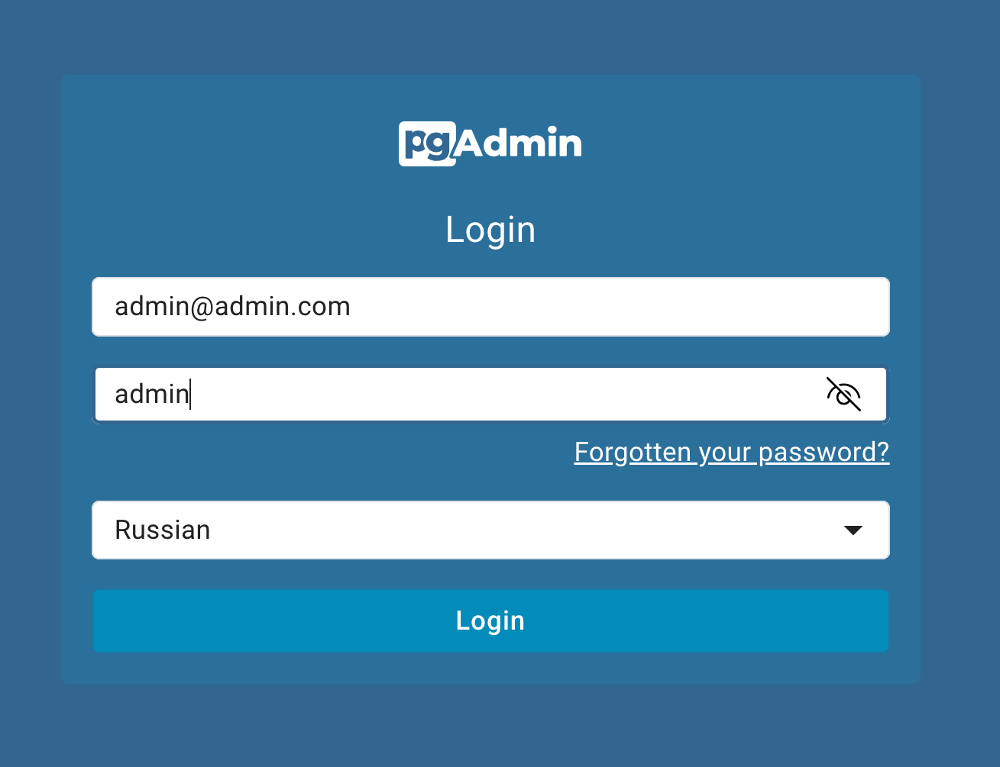
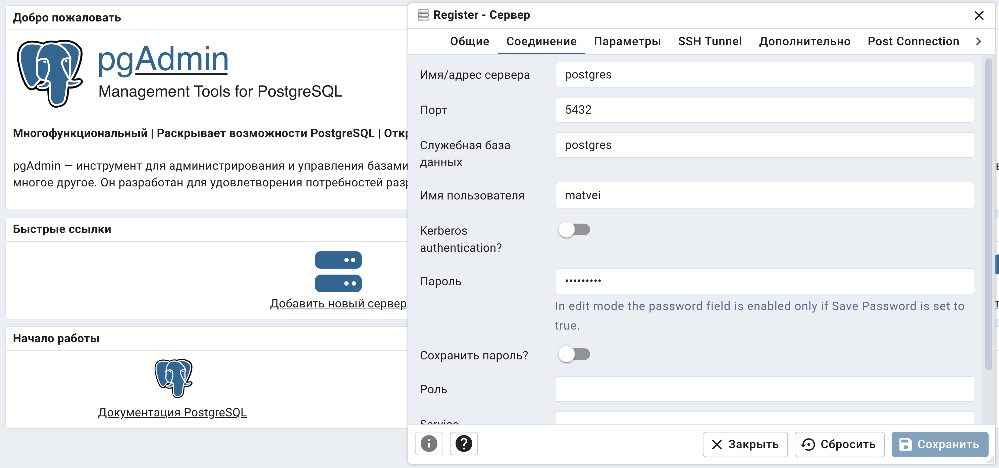
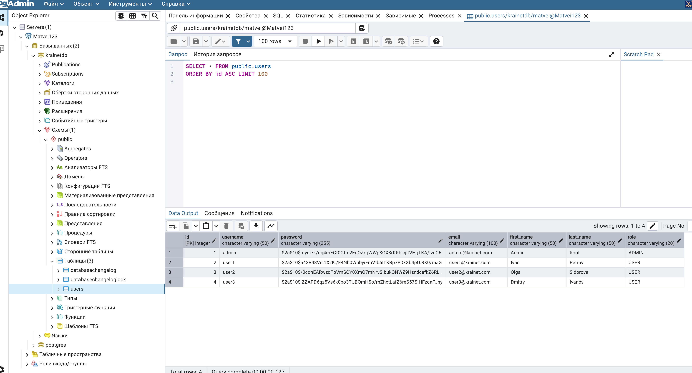
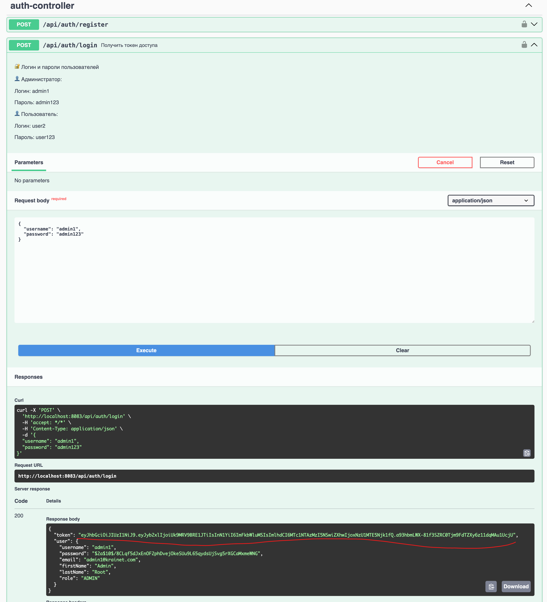
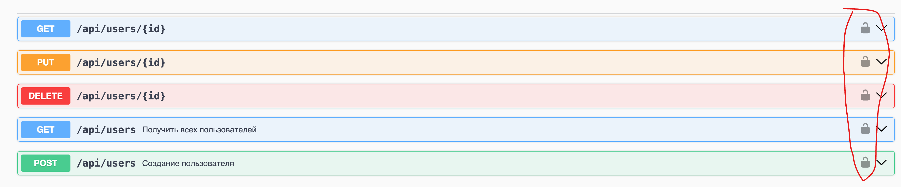
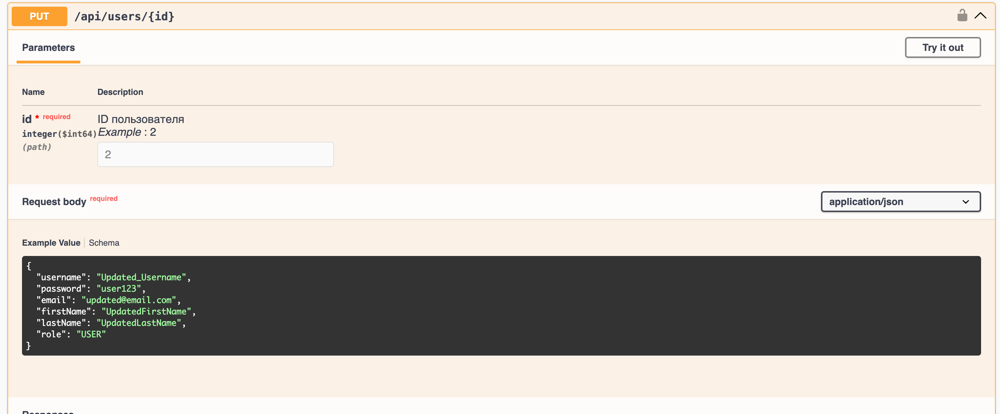

# Запуск программы

1. Docker-compose запустит несколько сервисов. Для доступа к ним, нужно освободить
несколько портов, если они заняты: 6543, 8081, 8082 и 8083.

2. В Docker-compose нужно вставить собственные данные: логин почты и код приложения (не обычный пароль).
У Gmail.com это можно сделать по адресу `https://myaccount.google.com/apppasswords`
      

      # Замените на ваши данные
      MAIL_USERNAME: your.mail@gmail.com
      MAIL_PASSWORD: app_password
      # Также заменить
      SPRING_MAIL_USERNAME: your.mail@gmail.com
      SPRING_MAIL_PASSWORD: app_password

3. В корневой папке с docker-compose.yml нужно ввести команду `docker-compose up --build`

## Проверка работоспособности базы данных

Перейти по адресу для доступа к базе данных `http://localhost:8081/login?next=/browser/`

1. Ввести данные логин и пароль:
- admin@admin.com
- admin

2. Нажать на «Добавить новый сервер»
3. Во вкладке «Общие» ввести любое имя 
4. Вкладку «Соединение» заполнить следующими данными:
- postgres
- 5432
- matvei
- Пароль: `secret123`

5. Проверить, что в базе данных krainetdb есть таблица Users. А в ней четыре пользователя —
один ADMIN и три USER. 

## Проверка работоспобности сервиса с пользовавателями USER и администраторами ADMIN

1. Перейти по ссылке `http://localhost:8083/swagger-ui/index.html#/`
2. Для большинства действий нужно получить JWT-токен.
- ADMIN может посмотреть информацию о всех пользователях, изменить все данные и
удалить всех пользователей. 
Только ADMIN  может поменять роль пользователя с USER на ADMIN.
- USER может посмотреть, отредактировать или удалить только свой аккаунт. 
3. Для получения JWT-токена, нужно пройти авторизацию по запросу в `/api/auth/login`
- ADMIN: логин `admin1`, пароль `admin123`
- USER: логин `user2`, пароль `user123`

4. ### !ВАЖНО! Вставить токен в меню, которое появляется по нажатию замочка. 
Тогда запросы будут идти с соответствующим токеном. При смене пользователя или админа нужно у замка удалять
старый токен и добавлять новый. Также токены имеют период действия. Может понадобится 
получить новый — также удалить старый и потом вставить новый. 
### !ВАЖНО! Для авторизации нового пользователя, нужно сначала выполнить Logout во вкладке с замочком.

5. После вставки токена можно пользоваться запросами. У большинства есть значения по
умолчанию для быстрой проверки работоспособности запросов.

6. Сервис отправляет запросы в сервис уведомлений, который рассылает уведомления на почту
администраторов ADMIN про изменений обычных пользователей USER. 
